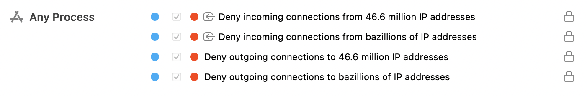

# Як заблокувати російські IP-адреси
Підписка на групу правиль Little Snitch для блокування трафіку в та з росії

## Навіщо? 
Якщо ви ставите собі таке питання, то "ваша русофобія недостатня" (С). 

Якщо дуже коротко, то російські спецслужби мають повний доступ до усіх з'єднань, що відбуваються в російських мережах. А певні архітектурні ~~вразливості~~ особливості інтернету дозволяють їм зазернути й за межі "суверенного інтернету".

Посилання на матеріали для тих, хто справді хоче розібратися в темі:
1. [Some Twitter traffic briefly funneled through Russian ISP, thanks to BGP mishap](https://arstechnica.com/information-technology/2022/03/absence-of-malice-russian-isps-hijacking-of-twitter-ips-appears-to-be-a-goof/)
2. [Hijacking the Internet Is Far Too Easy](https://slate.com/technology/2018/11/bgp-hijacking-russia-china-protocols-redirect-internet-traffic.html)
3. [SORM](https://en.wikipedia.org/wiki/SORM)

## Як?
Існує багато джерел інформцації про те, як діапазони IP-адрес розподілені між країнами. Я використав підписку на MacMind, яку раніше застосовував для форензіки та інших задач. (До речі, їхні бази даних добре інтегруються з Wireshark).

Послідовність дій з самостійного створення та оновлення правил Little Snitch я наведу пізніше. Зараз тут буде найпростіша інструкція з підписки на куровану групу правил в цьому репозитарії.

1. Купіть Mac та встановіть Little Snitch.

2. Відкрийте вікно ``Little Snitch Rules`` та додайте нову групу натиснувши на великий плюс.


3. У наступному вікні вставте посилання на підписку в цьому репозитарії.

```
https://raw.githubusercontent.com/sapran/russian_ip_ranges/main/block_ru_ip_ranges.lsrules
```


Натисніть ``Subscribe...``

4. Опціонально налаштуйте бажану періодичність оновлення правил.


5. У вікні правил відбудуться зміни: додасться нова група правил та власне нові правила.




6. Перевірте застосування правил. 

Відвідайте відомий вам російський вебсайт.


Відкрийте вікно Network Monitor та переконайтесь, що російський трафік блокується.

