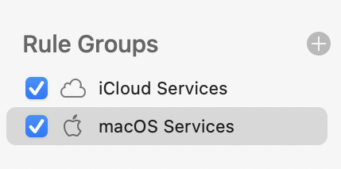

# Як заблокувати російські IP-адреси з допомогою Little Snitch на macOS
Підписка на групу правил Little Snitch для блокування трафіку в та з росії

## Навіщо? 
Якщо ви ставите собі таке питання, то "ваша русофобія недостатня" (С). 

Якщо дуже коротко, то російські спецслужби мають повний доступ до усіх з'єднань, що відбуваються в російських мережах. А певні архітектурні ~~вразливості~~ особливості всесвітньої мережі дозволяють їм зазирнути й за межі "суверенного інтернету". Хто справді хоче розібратися в темі, починайте гуглити за ключовими словами СОРМ2 та BGP hijacking. Звісно, це лише верхівка айсберга, але по ходу зорієнтуєтесь.

## Як?
Існує багато джерел інформації про те, як діапазони IP-адрес розподілені між країнами. Я використав підписку на [MaxMind](https://www.maxmind.com/en/geoip2-services-and-databases), яку раніше застосовував для форензіки та інших задач. (До речі, їхні бази даних добре інтегруються з Wireshark).

Послідовність дій з самостійного створення та оновлення правил Little Snitch я можливо наведу пізніше. Зараз тут буде найпростіша інструкція з підписки на куровану групу правил в цьому репозитарії.

1. Купіть Mac та встановіть Little Snitch.

2. Відкрийте вікно ``Little Snitch Rules`` та додайте нову групу натиснувши на великий плюс.



3. У наступному вікні вставте посилання на підписку в цьому репозитарії.

```
https://raw.githubusercontent.com/sapran/russian_ip_ranges/main/block_ru_ip_ranges.lsrules
```


Натисніть ``Subscribe...``

4. Опціонально налаштуйте бажану періодичність оновлення правил.


5. У вікні правил відбудуться зміни: додасться нова група правил та власне нові правила.


6. Перевірте застосування правил. 

Відвідайте відомий вам російський вебсайт.


Відкрийте вікно Network Monitor та переконайтесь, що російський трафік блокується.

